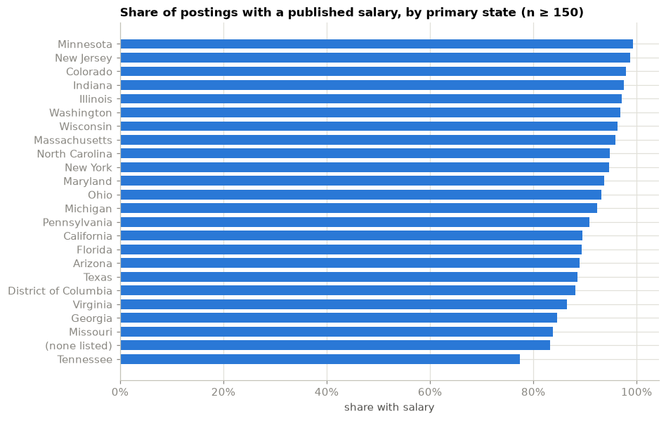
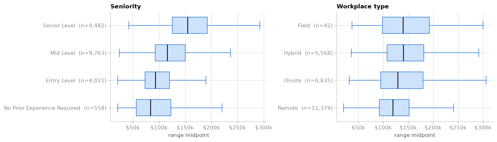
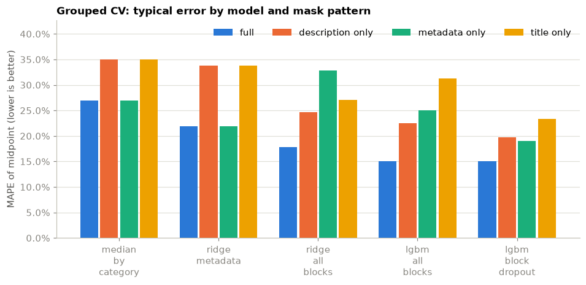
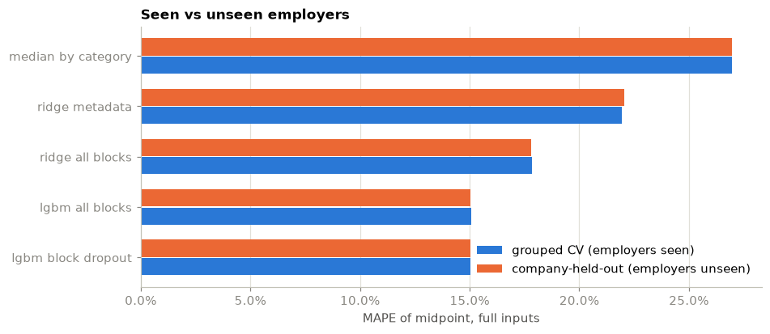
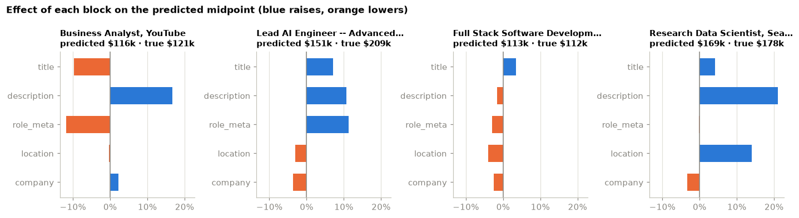

# The job title alone predicts pay within about 23%

I built a model that reads a job posting and predicts the salary range the employer will
advertise. Along the way it answered a question I found more interesting than the headline
accuracy: how much of a salary is explained by each part of a posting, and what happens
when you take parts away.

Here is what I learned from 24,000 postings, one idea at a time.

## Employers already tell you a lot, but only some employers

Pay-transparency laws in California, New York, Colorado, Washington, and a growing list of
other states require employers to print a salary range. In this dataset of US postings for
data, analytics, and software roles, 89% carry a range. But the share depends on where the
job is.

That matters for what a model like this can claim. It learns how employers who publish pay
set their ranges. It can guess what a silent employer would have written, but nobody
checked its homework on those.

## The obvious things move pay in the obvious direction

Before building anything clever, it is worth checking that the boring fields do what you
expect. They do. Seniority is the strongest single factor. Software and engineering roles
pay more than data and IT roles. More years of experience, bigger companies, and coastal
states all push the range up.

One small surprise: remote roles pay a little less than hybrid ones. That fits with remote
jobs being priced against a national band rather than a big-city one.

## The answer is printed on the page, so I had to hide it

Two thirds of the descriptions contain the exact salary figure in the text. A model
trained on those would learn to read the number rather than to understand the job, and
every accuracy score would be fiction.

So every dollar amount, every "120k", every "155000.00", and every range joined by a dash
gets replaced with a placeholder token before the model sees it. After scrubbing, a
posting's own salary figure survives in 5 of 23,824 descriptions. What is left is the
wording around pay, such as "competitive base plus equity", which is a fair clue about
the employer rather than the answer itself.

## Five blocks you can switch off

I split every posting into five groups of inputs:

| block | what it holds |
|---|---|
| title | the job title |
| description | the full text of the posting |
| role metadata | seniority, category, years of experience, required tools |
| location | state, remote or on-site, coordinates |
| company | employer name, size, age, sector |

The model is trained so that any block can be missing. Half of its training examples are
copies of real postings with random blocks blanked out. That sounds like it should hurt
the model when it has everything, and it does not: the accuracy with all five blocks is
identical, to three decimal places, to a model trained the ordinary way.

What it buys is graceful degradation. Here is the typical error, as a percentage of the
midpoint, for each combination of inputs:

| what you give it | typical error |
|---|---|
| everything | 15% |
| metadata only, no text | 19% |
| description only | 20% |
| title only | 23% |

A model trained without the blanking trick does badly when inputs go missing. On the
title alone it is worse than simply looking up the median salary for the job category,
because it never learned to cope without the description.

## The title alone is worth as much as six metadata fields

This was the one that surprised me. Given nothing but the title, the model predicts pay
within about 23%. That is the same accuracy I got from a simple linear model on six
structured fields (seniority, category, workplace type, state, experience, company size)
before the text was involved at all.

Titles are dense. "Senior Staff Machine Learning Engineer" carries the seniority, the
field, and a hint about the kind of employer that uses the word "Staff", all in five words.
That is why a title-only demo is a fair thing to put in front of people.

## Knowing the employer's name is worth almost nothing

I expected employer identity to matter a lot. Some companies are known for paying above
market. So I ran the whole benchmark twice: once where the model could have seen other
postings from the same employer during training, and once where every evaluated employer
was completely new to it.

The difference is within rounding. The employer's size, sector, and the way it writes
its postings already carry what the name would add. For a tool that will mostly be shown
employers it has never seen, that is the best possible news.

## What the model actually looked at

For any prediction, the model can say how much each of the five blocks pushed the estimate
up or down. Four real postings from the test set:

The description and the title usually do most of the work. Role metadata pulls the number
down for junior analyst roles and up for senior engineering ones. Location and company are
smaller nudges. This is the explanation the finished app shows: five bars, in dollars, no
jargon.

## What it cannot do

- It knows US salaried roles between 20,000 and 1,000,000 dollars a year, from a snapshot
  of mid-2026, for individual contributors. No managers, no other countries, no other years.
- It learned from employers who publish pay. Silent employers may price differently.
- It predicts the width of the range much less well than the level. Treat the band as
  "plausible", not as the number the employer has in mind.

## Try it

The browser demo at [https://alexanderwu.github.io/salary-scout/](https://alexanderwu.github.io/salary-scout/) runs entirely
on your machine: nothing you type is sent anywhere. Paste a title, or a description, or
just pick a seniority and a state, and see what changes. The
technical report with the full protocol and per-fold results is in `docs/report.md`.
