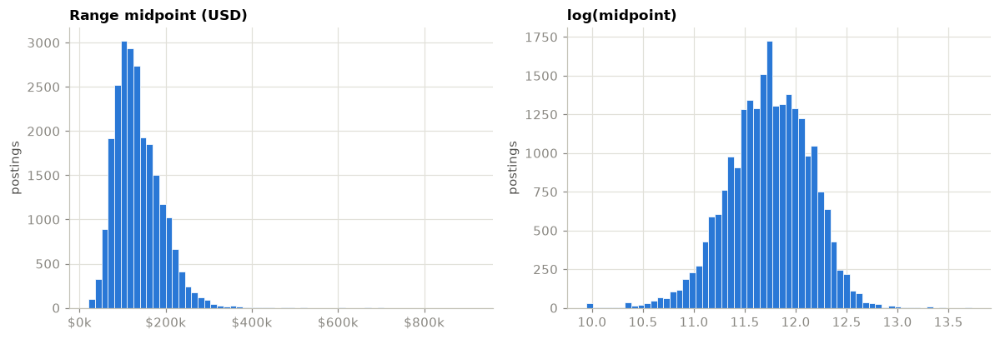
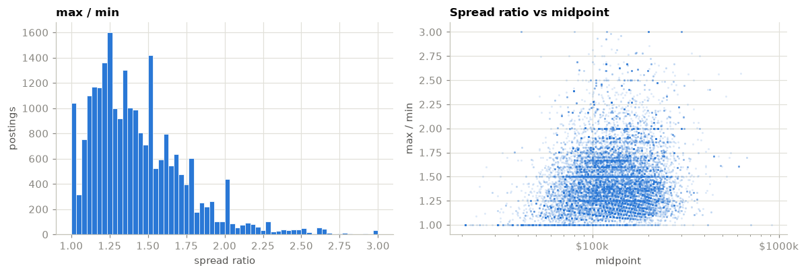
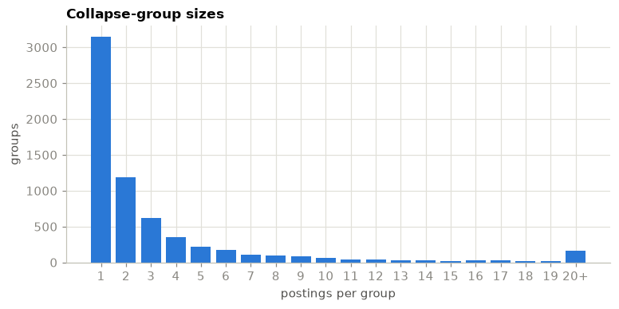

# Salary Scout: predicting the advertised salary range of a job posting

Technical report, September 2026. Companion notebooks: `notebooks/01_eda.ipynb` (data and
cleaning) and `notebooks/02_benchmark.ipynb` (models and results). Decisions referenced as
"ADR nnnn" are recorded in `docs/adr/`.

## 1. Summary

Salary Scout predicts the pay range an employer will advertise for a job posting, from the
posting's text and metadata, and it keeps working when whole groups of inputs are missing.
One LightGBM model, trained with random block dropout, serves every input pattern:

| inputs available | typical error (MAPE) | R² on log pay | true range overlaps predicted |
|---|---|---|---|
| everything | 15.0% | 0.75 | 84% |
| metadata only (no text) | 19.0% | 0.63 | 80% |
| description only | 19.7% | 0.60 | 77% |
| title only | 23.4% | 0.45 | 74% |

(Grouped five-fold cross-validation on 20,257 training postings. On the 3,567 newest
postings held out as a final test the full-input model does slightly better: MAPE 13.7%,
R² 0.76, overlap 93%.)

Three findings shape the product:

- **Block dropout is free.** Training with masked copies of the data costs nothing on fully
  specified inputs (−0.0002 ± 0.0009 log MAE) and cuts error on masked inputs by a quarter
  to two fifths. A model trained without it is worse than a category-median lookup on
  two of the three masked patterns.
- **Recognising the employer is worth almost nothing.** Scores on employers absent from
  training are within 0.002 log MAE of scores on employers seen in training, for every
  model and pattern. Headcount, sector, and the text already carry what the name would add.
- **The title alone predicts pay within about 23%.** That is as good as the six-field
  metadata baseline from the exploratory analysis, and it makes a low-effort demo credible.

The model describes the pricing behaviour of US employers who publish pay for
individual-contributor roles, mostly in data, analytics, and software, in mid-2026. Section 9
lists what that excludes.

## 2. Problem and data

**Task.** Given a job posting, predict the minimum and maximum of the salary range the
employer advertises. The user may supply any subset of five input groups: the title, the
description, role metadata (seniority, category, experience, tools), location, and employer
details. Predictions must come with an explanation of which input group drove them.

**Data.** 27,098 postings scraped from hiringcafe.com, unique on `requisition_id`, with 46
columns after flattening the enrichment JSON. All are individual-contributor roles. Job
categories are dominated by data and analytics (52%), software development (21%), IT (11%),
and engineering (9%). 95% were published between April and September 2026. The column
definitions are in `docs/jobs_data_dictionary.md`.

One column, `job_information_json`, holds account identifiers of people who viewed or
applied to each posting. It is never loaded, and a unit test asserts its absence (ADR 0002).

**Who publishes pay.** 24,191 postings (89%) carry a parsed range. Disclosure is not random:
it varies by state from 77% to 99%, tracking pay-transparency laws in California, New York,
Colorado, Washington, and elsewhere.


The model therefore learns from employers who choose or are required to disclose. A
prediction for a non-disclosing employer is an extrapolation.

## 3. Target and cleaning

### 3.1 What is predicted

Postings advertise a range, not a number. Two quantities are modelled in log space and the
range is rebuilt from them (ADR 0003):

- `log_mid = log((min + max) / 2)`, the pay level
- `log_spread = log(max / min)`, the width of the band, clipped at zero

Reconstructing min and max from these guarantees min ≤ max, which two independent
regressions do not. Pay is multiplicative in nature (a 10% raise is worth more at 200k than
at 60k) and the log midpoint is close to symmetric where the dollar midpoint is right-skewed.



The band width is only weakly related to the level (correlation 0.19 in log space), which
supports treating it as a separate target. 4% of postings advertise a single number.



### 3.2 Which rows are trusted

Raw annualised compensation runs from 1 dollar to 340 million. The extremes are unit
errors in both directions: hourly rates stored as yearly (51.80 to 60.69) and yearly
salaries multiplied by 2,080 as if they were hourly (223,479,360). Repairing them would mean
guessing the direction of each error, so rows outside a plausible envelope are dropped
instead (ADR 0004). The funnel:

| rule | rows kept | rows dropped |
|---|---|---|
| all postings | 27,098 | |
| has a parsed range | 24,191 | 2,907 |
| currency is USD | 24,037 | 154 |
| yearly minimum ≥ 20,000 | 23,927 | 110 |
| yearly maximum ≤ 1,000,000 | 23,902 | 25 |
| max / min ≤ 3 | 23,824 | 78 |
| min ≤ max | 23,824 | 0 |

23,824 postings remain, 98.5% of those that publish pay. The thresholds sit at the
annualised US minimum wage, the 99.9th percentile of the raw data, and just above the 99th
percentile of the spread ratio, where wider ranges are placeholders such as "10,000 to
300,000". The cost is that the model cannot price part-time or hourly contract work below
20k a year, or the handful of roles above 1M. Non-USD postings (a few dozen each in CAD,
EUR, and GBP) are out of scope rather than converted.

## 4. Leakage: the answer is printed in the input

Pay-transparency postings print the range in the body. The exact minimum figure appears
verbatim in 67% of raw descriptions. A text model trained on those would learn to read the
number off the page, every benchmark score would be meaningless, and a "description only"
mode would silently become "copy the salary".

Every text field used as input (title, normalised title, description, requirements summary)
is HTML-stripped and then passed through a regular-expression scrubber that replaces dollar
amounts, comma-grouped numbers, `120k` style figures, bare five- and six-digit integers, and
ranges joined by dashes or "to" with a `[SALARY]` token (ADR 0005, extended in ADR 0009).
The phrasing around pay ("plus equity", "pay transparency statement") is kept on purpose; it
is legitimate signal about the employer.

A pipeline check then searches the scrubbed text of every row for that row's own minimum
or maximum in every written form. Before the ADR 0009 extension it found the figure in 1.8%
of rows, almost all of them bare numbers such as `100k-150k` or `155000.00`. After it, the
figure survives in 0.02% of rows (5 of 23,824). The check fails the build above 0.1%.

Two further safeguards: the derived modelling table does not carry the raw text columns
at all, so nothing downstream can featurise unscrubbed text by accident (ADR 0011), and the
scrubber runs on a single posting at inference time through the same function.

## 5. Split protocol

Three properties of the data make a random row split misleading (ADR 0006):

- **Siblings.** `collapse_key` groups near-identical postings: the same role on several
  boards, in several locations, or at several levels. 86.8% of usable postings sit in a
  group with siblings, but only 13% of multi-posting groups share an identical salary. They
  are families, not copies: same title, employer, and most of the description.
- **Employer concentration.** A few employers contribute one to two hundred postings each
  out of about 6,900.
- **Time.** The data is a five-month snapshot, not a series.



The protocol used throughout:

1. **Final test set.** The newest 15% of postings by publish date, with whole collapse
   groups on one side only. 3,567 test rows, 20,257 training rows. Scored once, at the end.
2. **Model selection.** Five-fold cross-validation on the training split, grouped by
   `collapse_key`, so no sibling of a validation posting is in its training fold.
3. **Employer-held-out evaluation.** The same five-fold protocol grouped by
   `company_name`, reported separately, so that every evaluated employer is unseen.

The feature transformer is fitted inside every fold because the employer encoding uses the
target (section 6). Nothing is tuned on the fold being scored: tree counts are fixed and
there is no early stopping.

## 6. Feature blocks and masking

### 6.1 Five blocks

Features are organised into five named blocks that map one-to-one onto the inputs a user
can supply or withhold (ADR 0007):

| block | source columns | representation |
|---|---|---|
| `title` | title, normalised title | hashed 1- and 2-grams, 2 × 2^16 columns |
| `description` | description, requirements summary | hashed unigrams, 2^18 + 2^16 columns, text capped at 30k characters, log length |
| `role_meta` | seniority, category, years of experience, commitment, degree requirements, security clearance, visa sponsorship, technical tools | one-hot, ordinal seniority, multi-hot top-300 tools plus a 4,096-column hashed remainder |
| `location` | workplace type, primary state, countries, latitude and longitude | one-hot, numeric with missing indicators |
| `company` | employer name, headcount, founding year, organisation type, sector and industries, HQ country, source ATS | target encoding of the name (below), one-hot, multi-hot industries, log headcount, company age |

The full matrix has 463,742 sparse columns and fits on the training split in about seven
seconds. Text features are hash-based rather than vocabulary-based so that the featuriser
can be reimplemented in JavaScript for the browser demo without shipping a vocabulary
(ADR 0008).

### 6.2 Employer identity

The training split has 6,924 employers. Their names are encoded as the smoothed mean of
`log_mid` (smoothing weight 10 toward the global mean) plus the log of the employer's
training frequency (ADR 0010). Target encoding leaks unless it is cross-fitted, and plain
K-fold cross-fitting is not enough here: a row's encoding would be computed from its own
siblings. The encoder therefore cross-fits with folds grouped by `collapse_key`, so each
training row is encoded from other collapse groups only. Unknown or masked employers
receive the prior. The browser demo can ship this as a table of about 7k floats.

### 6.3 Masking and block dropout

A masked block is represented as missing values in all of its columns plus a per-block
presence indicator set to zero. The model is trained on the original training rows plus one
copy of each row in which every block has been masked independently with probability 0.3,
keeping at least one block per row. The feature transformer is fitted on that augmented
frame so the employer encoding stays cross-fitted for the copies too.

Explanations use TreeSHAP contributions from LightGBM, summed over each block's column
range, so the user sees "what kind of information moved the estimate" rather than which
of 460k hashed columns did.

## 7. Results

### 7.1 Models compared

In order of complexity:

- **median by category**: median `log_mid` of training rows with the same job category and
  seniority; global median when either is masked.
- **ridge on metadata**: ridge regression (alpha 1.0) with the two text blocks zeroed.
- **ridge on all blocks**: the same ridge on the full 464k-column matrix.
- **LightGBM on all blocks**: 800 trees, learning rate 0.05, 63 leaves, column sampling 0.3,
  row sampling 0.8. No dropout.
- **LightGBM with block dropout**: the same model on the augmented training frame.

Every model predicts both targets. Metrics are reported on `log_mid` (MAE and R²), on the
midpoint in dollars (MAE and MAPE), on the range (share of postings whose true range
overlaps the predicted one), and on `log_spread` (MAE).

### 7.2 Grouped cross-validation

Log MAE on `log_mid`, mean over five collapse-grouped folds. Lower is better; the
exploratory-analysis floor was a metadata-only ridge at 0.22.

| model | full | description only | metadata only | title only |
|---|---|---|---|---|
| median by category | 0.256 | 0.317 | 0.256 | 0.317 |
| ridge on metadata | 0.212 | 0.325 | 0.212 | 0.325 |
| ridge on all blocks | 0.174 | 0.246 | 0.414 | 0.270 |
| LightGBM on all blocks | 0.147 | 0.247 | 0.291 | 0.380 |
| LightGBM with block dropout | 0.147 | 0.190 | 0.185 | 0.224 |

The same comparison in MAPE on the dollar midpoint, which is the number a user feels:


Full metrics for the dropout model, the one carried forward:

| pattern | log MAE | R² | MAE (USD) | MAPE | range overlap | spread MAE |
|---|---|---|---|---|---|---|
| full | 0.147 | 0.746 | 19,034 | 15.0% | 83.9% | 0.116 |
| metadata only | 0.185 | 0.627 | 23,645 | 19.0% | 79.5% | 0.136 |
| description only | 0.190 | 0.604 | 24,479 | 19.7% | 77.4% | 0.127 |
| title only | 0.224 | 0.449 | 28,481 | 23.4% | 73.9% | 0.156 |

Fold-to-fold standard deviation of log MAE is at most 0.006 for the dropout model on every
pattern. The no-dropout model varies by up to 0.04 on title only.

### 7.3 Time holdout

Every model refitted on the whole training split and scored once on the newest 15% of
postings. Dropout model:

| pattern | log MAE | R² | MAE (USD) | MAPE | range overlap |
|---|---|---|---|---|---|
| full | 0.143 | 0.759 | 22,797 | 13.7% | 92.7% |
| metadata only | 0.175 | 0.658 | 26,820 | 16.8% | 89.2% |
| description only | 0.195 | 0.574 | 30,522 | 18.3% | 86.1% |
| title only | 0.226 | 0.450 | 34,397 | 21.0% | 78.6% |

The holdout scores slightly better than the cross-validation on relative error, so there
is no sign of drift across the snapshot. Dollar MAE is higher because the newest postings
pay more on average; MAPE is the comparable figure.

### 7.4 What block dropout costs

The single number ADR 0007 hinged on: LightGBM with dropout minus LightGBM without, on
fully specified inputs, per fold. The difference is −0.0002 ± 0.0009 log MAE,
indistinguishable from zero. On masked inputs the same model gains:

| pattern | no dropout | with dropout | change |
|---|---|---|---|
| full | 0.147 | 0.147 | 0.000 |
| description only | 0.247 | 0.190 | −23% |
| metadata only | 0.291 | 0.185 | −36% |
| title only | 0.380 | 0.224 | −41% |

Without dropout the tree model is worse than the category-median baseline on metadata
only and title only, and the ridge on all blocks collapses to R² −0.49 on metadata only.
Models that never see a missing block at training time do not degrade gracefully when one
is removed. The decision to serve every pattern from one dropout-trained model stands;
the fallback of one model per pattern is not needed.

### 7.5 What the employer is worth

Company-held-out folds repeat the cross-validation with every evaluated employer absent
from the training fold.

| model | employers seen (log MAE, full) | employers unseen | difference |
|---|---|---|---|
| ridge on metadata | 0.212 | 0.214 | +0.002 |
| ridge on all blocks | 0.174 | 0.174 | 0.000 |
| LightGBM on all blocks | 0.147 | 0.148 | +0.001 |
| LightGBM with block dropout | 0.147 | 0.148 | +0.001 |


Every model and pattern moves by at most 0.002. Recognising the employer by name adds
almost nothing beyond headcount, sector, organisation type, and the text. Two caveats
apply. Most employers have only a few postings, so their encoding sits near the prior
anyway. And descriptions often name the employer, so "unseen" applies to the encoding, not
to the text. The practical consequence is good: the app can be honest about unknown
employers without a large accuracy penalty.

### 7.6 Range width

LightGBM predicts `log_spread` with MAE 0.115 against 0.157 for the constant median, so
the width of the band is partly predictable but remains the weaker target. A typical
range is 20% to 60% wide relative to its minimum; the model predicts the max/min ratio to
within about 12% on average.

## 8. Attributions

TreeSHAP contributions from the dropout model, summed per block and expressed as the
multiplicative effect on the predicted midpoint (`exp(v) − 1`). Four test postings with
full inputs:


The model's baseline (its expected `log_mid`) is a midpoint of 122,049 USD. Each block
moves the estimate up or down from there:

| posting | true range | predicted range | title | description | role meta | location | company |
|---|---|---|---|---|---|---|---|
| Business Analyst, YouTube (NY) | 100,000 to 142,000 | 99,397 to 131,734 | −9.7% | +16.8% | −11.8% | −0.3% | +2.2% |
| Lead AI Engineer, Target (MN) | 132,000 to 286,000 | 120,114 to 181,261 | +7.2% | +10.8% | +11.3% | −3.1% | −3.6% |
| Full Stack Software Development Engineer, CVS Health (PA) | 64,890 to 158,620 | 76,421 to 149,520 | +3.5% | −1.6% | −2.9% | −4.0% | −2.5% |
| Research Data Scientist, Google (CA) | 147,000 to 210,000 | 141,120 to 197,850 | +4.2% | +21.1% | −0.1% | +14.1% | −3.4% |

Reading the first row: the title "Business Analyst" and the role metadata (mid-level analyst)
each pull the estimate down by about a tenth, while the description, which reads like a
technical role at a large platform, pushes it up by a sixth. The Target posting shows the
model under-predicting a very wide advertised range, which is the spread weakness from
section 7.6. The Google posting is the one case where location carries a large effect, as
California should.

The description and title typically carry the largest effects, and role metadata pulls
the estimate down for junior analyst roles. The explanation view in the apps shows exactly
this: five bars, one per block, in units the user understands.

## 9. Limitations

- **Disclosing employers only.** The data is the pay published by employers who publish it.
  Disclosure varies by state from 77% to 99%. A prediction for an employer that does not
  disclose is an extrapolation whose error is not measured here.
- **US only, USD only.** Non-USD postings were a few dozen per currency and were dropped.
- **A 2026 snapshot.** 95% of postings are from April to September 2026. The time holdout
  shows no drift within that window, but the model has no basis for pay in other years.
- **Individual-contributor roles.** The source has no management or executive postings.
  The category mix is dominated by data, analytics, and software.
- **Annual salaried pay between 20k and 1M.** Hourly contract work below 20k a year and
  roles above 1M were removed as implausible or out of scope.
- **The spread is weak.** The band width is predicted with R² well below the level.
  Predicted ranges should be read as "a plausible band", not as the employer's exact range.
- **Scrubbing is imperfect.** Five of 23,824 rows still contain their own salary figure
  in an unusual format. The check tolerates up to 0.1%.
- **Hashed text is a bag of words.** No sentence encoder was used, by design, so the
  featuriser can run in a browser. Meaning that depends on word order beyond 2-grams in the
  title is not captured.

## 10. What the apps will and will not claim

Two deployment targets are planned (ADR 0008, proposed).

**Browser demo.** A smaller LightGBM exported to ONNX, run with ONNX Runtime Web, with the
hashing featuriser reimplemented in JavaScript and the employer table shipped as data.
Shrinking the text hashes to 2^16 (description) and 2^14 (title) columns changes log MAE
by under 0.002, so the browser model can be nearly as accurate as the full one. No data
leaves the page.

**Service.** The full dropout model behind a FastAPI service in Docker, with the same
block-masking contract.

Both will:

- accept any subset of the five blocks and state which were used
- show a range, not a point, rebuilt from both targets
- show the five per-block attributions
- show the typical error for the input pattern in use (the MAPE column of section 7.2)
- say that an unknown employer received the prior

Neither will claim to know pay outside the scope in section 9, and neither will describe
its output as what a specific employer will offer a specific candidate.

## Appendix: reproducing the numbers

```sh
uv sync --extra dev
uv run python -m salary_scout.dataset                     # derived table, ~30 s
uv run jupyter nbconvert --to notebook --execute --inplace notebooks/01_eda.ipynb
uv run jupyter nbconvert --to notebook --execute --inplace \
    --ExecutePreprocessor.timeout=-1 notebooks/02_benchmark.ipynb   # ~40 min
```

Per-fold result tables are committed in `docs/results/` (grouped CV, time holdout,
company held-out), with one row per protocol, fold, model, and pattern. Seeds are fixed.
